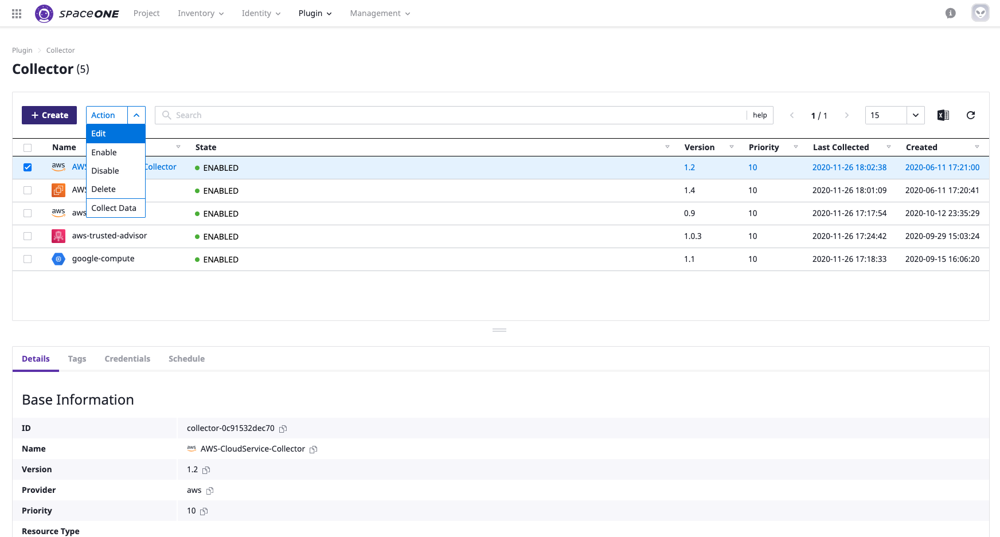
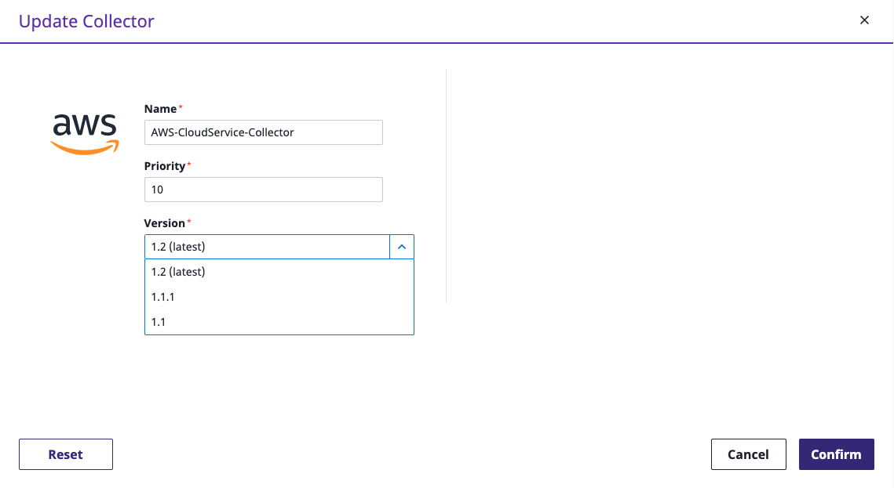

# inventory.Collector

inventory.Collector 타 플러그인 버전을 변경 합니다. 

## plugin 버전 변경

* 플러그인 변경은 SpaceOne Console을 통해 편리하게 최신버전으로 간단하게 변경 가능합니다. 
* SpaceOne 콘솔에 로그인 후 _Plugin &gt; Collector_ 로 이동
* 변경 대상 Collector를 선택 후 _Action &gt; Edit_ 클릭

* _Update Collector_ 화면에서 _Version_ 리스트 박스 클릭 후 변경하고자 하는 버전 선택 후 _Confirm_ 클릭

